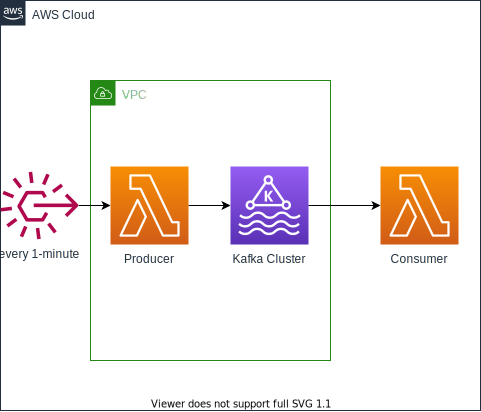

# Example AWS CDK app - Serverless Kafka lambda producer/consumer

This is a example project which demonstrate how to publish kafka messages to a AWS MSK serverless cluster and then consume them in another lambda function.

## Architecture

## Useful commands

- `npm run build` compile typescript to js
- `npm run watch` watch for changes and compile
- `npm run test` perform the jest unit tests
- `cdk deploy` deploy this stack to your default AWS account/region
- `cdk diff` compare deployed stack with current state
- `cdk synth` emits the synthesized CloudFormation template
